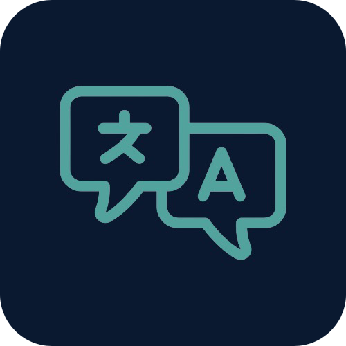
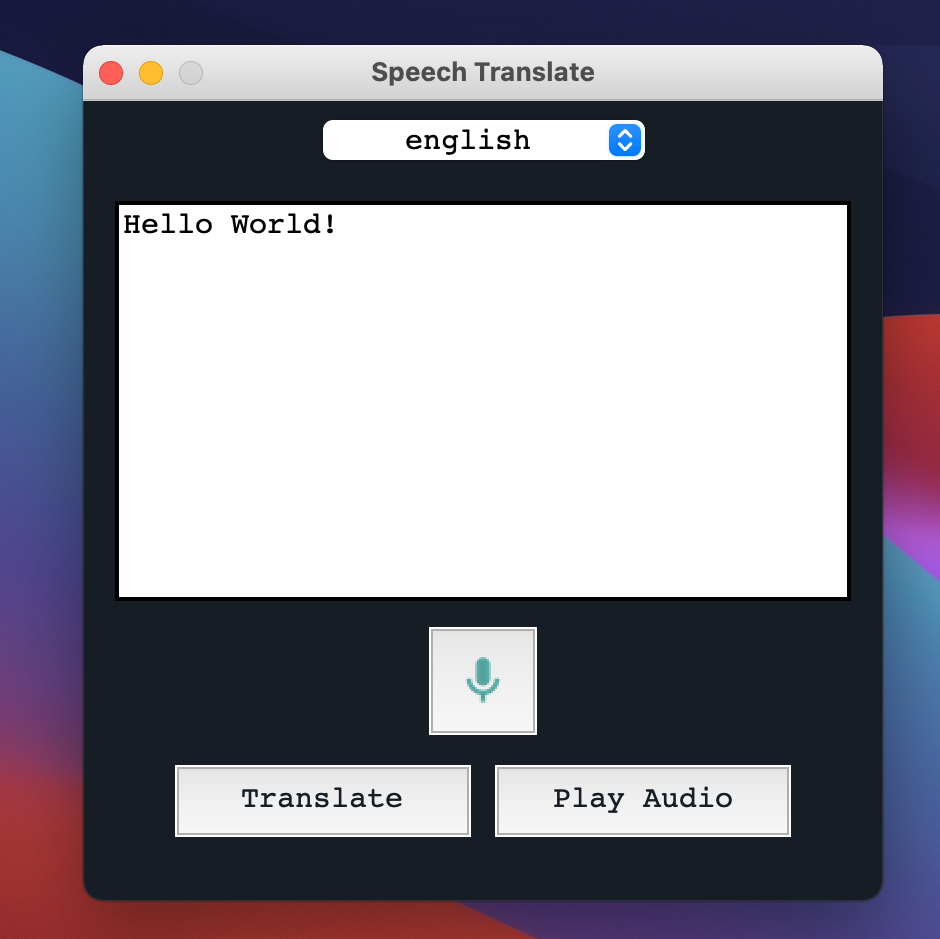

# speechTranslate [](https://opensource.org/licenses/MIT)

The `speechTranslate` application Python application that  a user's speech and translates it to different languages using the Google Translate API.



## Installing the Application
Access your your desired folder

Clone this repository in the  folder
```sh
git clone https://github.com/ahmedwab/speechTranslate
```

## Installing the Application

Ensure that you have the Latest Version of Python 3 installed.
That could be retrieved from https://www.python.org/downloads/

### Mac
For Mac Users, you will have to do the following

```sh
	brew update
	brew install portaudio
	brew install mpg321
	pip3 install pyaudio

```

Moreover, to install all the dependencies you can do the following
```sh
	bash dependencies.sh

```


## Running the application 

To run the application, you must navigate to the application folder 

Then, you can run it using the following command
```sh
python3 translate.py
```
## Using the application


The translate application can retrieve two inputs and here's how to use them

1. Speech Input

Select desired translation

Click on Speech Translate

Speak within 10 seconds

2. Text Input

Select desired translation

Input text in text input box

Click on Translate

Moreover, you can play audio if there is a supported language available by selecting Play Audio
    


## Project Status

As of now, the application is completed.

Looking for conributors that are familiar with American Sign Language to add necessary features

Any suggestions or changes is highly encouraged.


## Contributing

Contributing is greatly encouraged.

1. Fork the Project
2. Create your Feature Branch 
3. Commit your Changes 
4. Push to the Branch 
5. Open a Pull Request


## License

Distributed under the MIT License. See `LICENSE` for more information.
